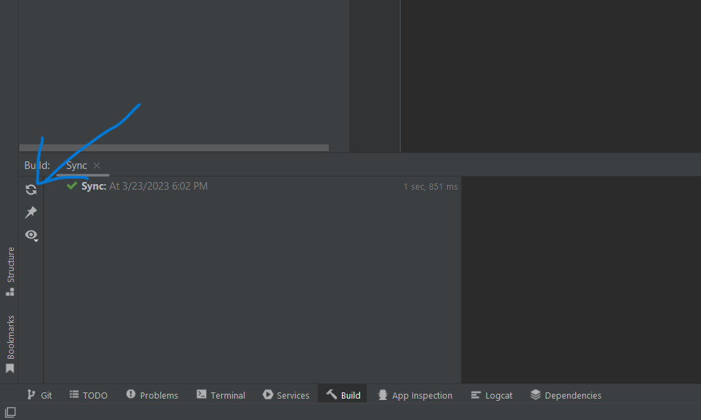

                                   Linking Mongodb to Java

You can link mongodb to your Java project using maven.

###### How to link your Java project to mongodb

#### 1. Create a new maven project using intellij IDEA.
#### 2. Copy the code in the pom.xml to your pom.xml file
#### 3.Click on the Sync button in your 'Build tab'

#### 4. Make sure you have an active internet connection
### 5. 🥳🥳🥳🥳 Hurray you name have you mongodb setup with you Java Project
#### 6. You can refer to the code in this repository to know how to perform basic CRUD operations
#### 7. Incase you are still facing issues just clone this repository and start coding 😏.

                    Author Nusetor Delali Foster GodeMode 
